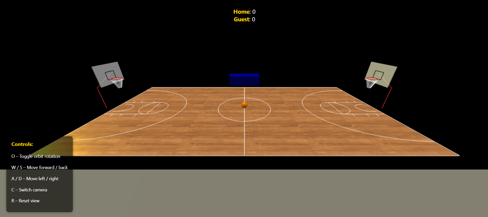
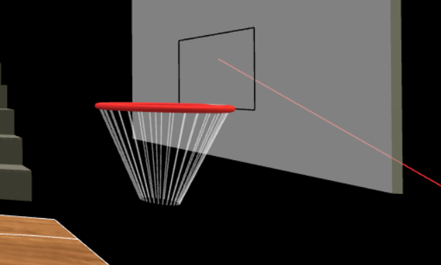
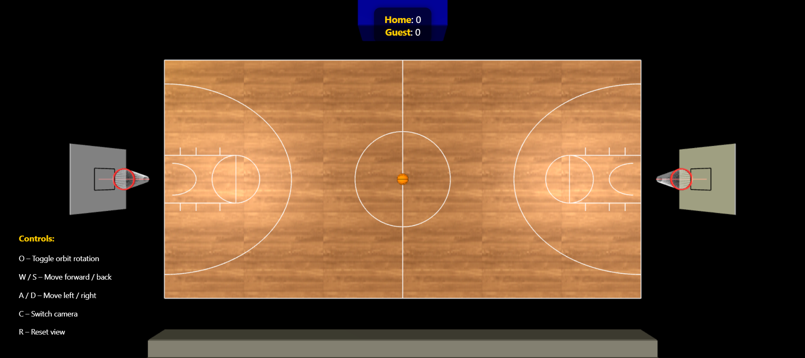

# Computer Graphics – Exercise 5 & 6 – WebGL Basketball Court

## Getting Started

1. **Clone** this repository to your local machine
2. Make sure you have **Node.js** installed
3. Start the local web‑server
   ```bash
   node index.js
   ```
4. Open your browser and go to [http://localhost:8000](http://localhost:8000)

---

## Group Members

- **Omri Nir**

---

## Implemented Features

| Category           | Details                                                                                                                                                                 |
| ------------------ | ----------------------------------------------------------------------------------------------------------------------------------------------------------------------- |
| Court & Markings   | Full maple floor, white court lines, side boxes and arcs.                                                                                                               |
| Hoops              | Red torus rims, semi‑transparent white backboards, white nets.                                                                                                          |
| Environment        | Ambient + 3 directional lights (warm yellow accent + cool white fill).                                                                                                  |
| Stands             | Five‑tier spectator stands behind the sideline.                                                                                                                         |
| Interactive camera | `O` – enable/disable orbit rotation`W/S` – move forward / back (POV)`A/D` – strafe left / right`C` – main camera ↔ bird’s‑eye camera`R` – reset both cameras & controls |
| UI                 | Top‑centre scoreboard (Home / Guest) and bottom‑left controls overlay.                                                                                                  |
| Officials' Table   | With Table Official as a profession, I couldn't not placing a table in there :)      
#EX6 features
| Ball Controls      | Arrow keys move the ball, W/S adjust shot power, Space to shoot, R resets ball to center. |
| Physics & Shooting | Realistic gravity, friction, bounces, parabolic trajectory, and spin; shot angle calculated to nearest rim. |
| Scoring & Feedback | Shots and scores tracker, dynamic scoreboard (Home/Guest), white visual feedback for shot strength. |
| Power UI           | Right side vertical power meter with numeric value and ideal power range display. |
| Suggested Range    | The range that the ball most likley will go in if shot with power within the range. |

---

## External Assets

| Asset                             | Source                                                    |
| --------------------------------- | --------------------------------------------------------- |
| `MapleTexture.webp` (court floor) | Downloaded seamless maple‑wood texture – **Shutterstock** |

All other geometry, materials and code were created from scratch by the author.

---

## Mandatory Screenshots

| Description                      | Preview                                   |
|----------------------------------|-------------------------------------------|
| Overall view of the court        |                      |
| Close-up of hoop & net           |                 |
| Basketball at centre court       |                  |
| Demonstration of camera controls | [▶ Watch clip](docs/Movement.mp4)         |
| Demonstration of ex06 features   | [▶ Watch clip](docs/Shooting.mp4)         |
---
**Clarification - The music in the demonstration video (of ex06) is not part of the game, it was playing on my computer while recording... 😅 I left it in because I think it  actually really adds to the video.**


